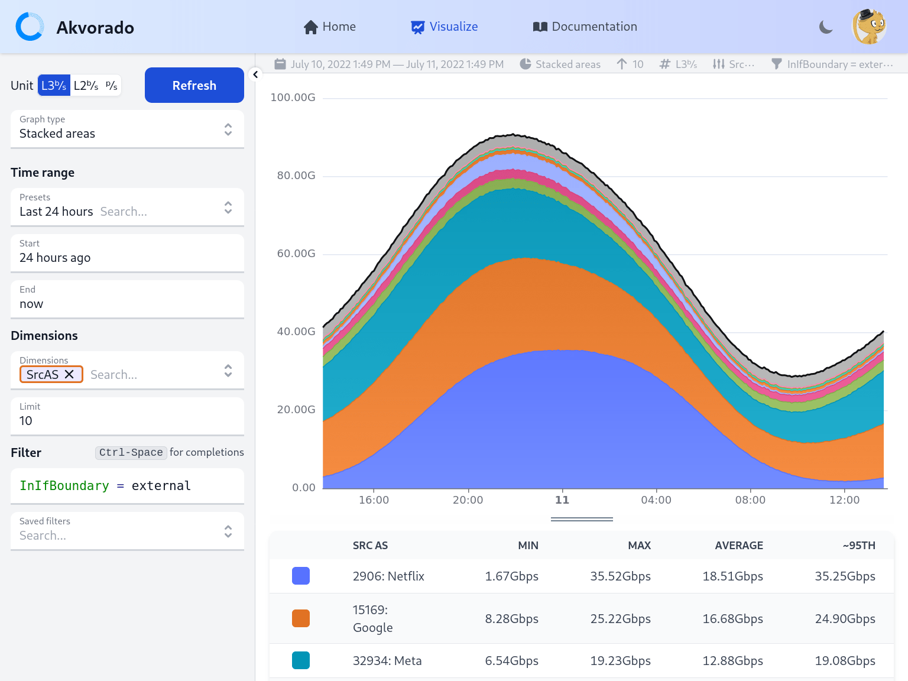
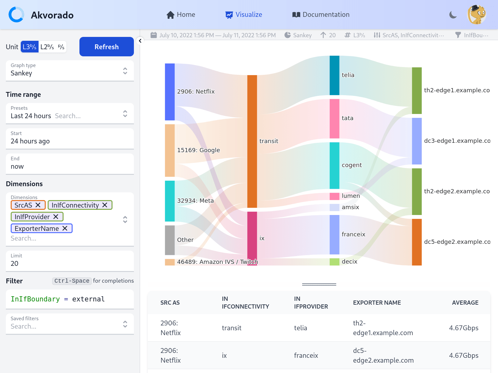

# Akvorado: flow collector, enricher and visualizer &middot; [](https://github.com/akvorado/akvorado/actions/workflows/ci.yml) [](https://codecov.io/gh/akvorado/akvorado) [](LICENSE.txt) [](https://github.com/akvorado/akvorado/releases)

This program receives flows (currently NetFlow/IPFIX and sFlow), enriches them
with interface names (using SNMP), geo information (using IPinfo.io),
and exports them to Kafka, then ClickHouse. It also exposes a web
interface to browse the collected data.





*Akvorado* is developed by [Free](https://www.free.fr), a French ISP,
and is licensed under the [AGPLv3 license](LICENSE.txt).

A demo site using fake data and running the latest stable version is
available on [demo.akvorado.net](https://demo.akvorado.net). It is the
direct result of running `docker compose up` on a fresh checkout but
port 2055 is not accessible (you cannot send you own flows). Please,
be gentle with this resource. The demo site also enables you to browse
the [documentation](https://demo.akvorado.net/docs) for the current version
(the one in `docs/` is for the next version).

By default, *Akvorado* is using [IPinfo](https://ipinfo.io) databases for
geolocation data.

A [Grafana plugin](https://github.com/ovh/grafana-akvorado) is available.

> [!CAUTION]
> Be sure to always read the [changelog](console/data/docs/99-changelog.md)
> before upgrading.

## Getting help

The first step is to read the [documentation](https://demo.akvorado.net/docs):

- the [introduction](https://demo.akvorado.net/docs/intro)
- the [configuration guide](https://demo.akvorado.net/docs/configuration)
- the [troubleshooting guide](https://demo.akvorado.net/docs/troubleshooting)

If you still need help, you can use the
[discussions](https://github.com/akvorado/akvorado/discussions/categories/q-a).
Be sure to explain what you tried to solve your problem. Enclose code using
triple backticks:

````
```
# akvorado version | head -2
akvorado v1.11.2
 Built with: go1.23.2 X:loopvar
```
````
