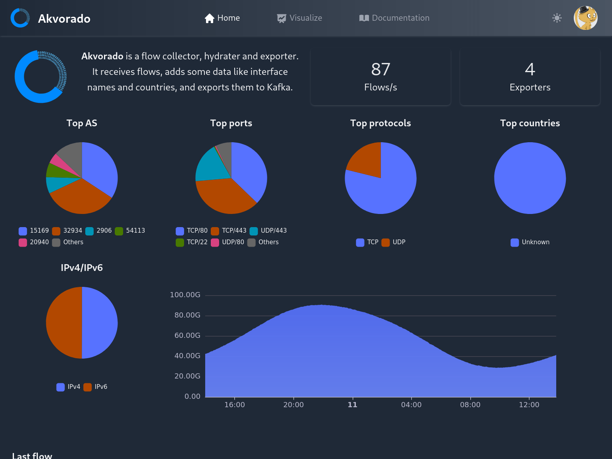

# Usage

*Akvorado* uses a subcommand system. Each subcommand comes with its
own set of options. It is possible to get help using `akvorado
--help`. Each service is started using the matchin subcommand. When
started from a TTY, a service displays logs in a fancy way. Without a
TTY, logs are output formatted as JSON.

## Common options

Each service accepts a set of common options as flags.

The `--check` option will check if the provided configuration is
correct and stops here. The `--dump` option will dump the parsed
configuration, along with the default values. It should be combined
with `--check` if you don't want the service to start.

Each service requires as an argument either a configuration file (in
YAML format) or an URL to fetch their configuration (in JSON format).
See the [configuration section](02-configuration.md) for more
information.

It is expected that only the orchestrator service gets a configuration
file and the other services should point to it.

```console
$ akvorado orchestrator /etc/akvorado/config.yaml
$ akvorado inlet http://orchestrator:8080
$ akvorado console http://orchestrator:8080
$ akvorado console http://orchestrator:8080#2
```

Each service embeds an HTTP server exposing a few endpoints. All
services expose the following endpoints in addition to the
service-specific endpoints:

- `/api/v0/metrics`: Prometheus metrics
- `/api/v0/version`: *Akvorado* version
- `/api/v0/healthcheck`: are we alive?

Each endpoint is also exposed under the service namespace. The idea is
to be able to expose an unified API for all services under a single
endpoint using an HTTP proxy. For example, the `inlet` service also
exposes its metrics under `/api/v0/inlet/metrics`.

## Inlet service

`akvorado inlet` starts the inlet service, allowing it to receive and
process flows. The following endpoints are exposed by the HTTP
component embedded into the service:

- `/api/v0/inlet/flows`: stream the received flows
- `/api/v0/inlet/schemas.proto`: protobuf schema

## Orchestrator service

`akvorado orchestrator` starts the orchestrator service. It runs as a
service as it exposes an HTTP service for other components (internal
and external) to configure themselves. The Kafka topic is configured
at start and does not need the service to be running.

The following endpoints are exposed to configure other internal
services:

- `/api/v0/orchestrator/configuration/inlet`
- `/api/v0/orchestrator/configuration/console`

The following endpoints are exposed for use by ClickHouse:

- `/api/v0/orchestrator/clickhouse/protocols.csv` contains a CSV with the mapping
  between protocol numbers and names
- `/api/v0/orchestrator/clickhouse/asns.csv` contains a CSV with the mapping
  between AS numbers and organization names

ClickHouse clusters are currently not supported, despite being able to
configure several servers in the configuration. Several servers are in
fact managed like they are a copy of one another.

*Akvorado* also handles database migration during upgrades. When the
protobuf schema is updated, new Kafka tables should be created, as
well as the associated materialized view. Older tables should be kept
around, notably when upgrades can be rolling (some *akvorado*
instances are still running an older version).

## Console service

`akvorado console` starts the console service. It provides a web
console.

### Home page



The home page contains a few statistics:

- number of flows received per second
- number of exporters
- flow repartition by AS, ports, protocols, countries, and IP families
- last flow received

### Visualize page

The most interesting page is the “visualize” tab which
allows a user to explore data using graphs.


The collapsible panel on the left has several options to change the
aspect of the graph.

- The unit to use on the Y-axis: layer-3 bits per second, layer-2 bits per
  second (should match interface counters), packets par second, percentage of
  use of the input interface or output interface. For percentage use, you should
  group by exporter name and interface name or description for it to make sense.
  Otherwise, you would get an average over the matched interfaces. Also, because
  interface speeds are retrieved infrequently, the percentage may be temporarily
  incorrect when an interface speed changes.

- Four graph types are provided: “stacked”, “lines”, and “grid” to
  display time series and “sankey” to show flow distributions between
  various dimensions.

- For “stacked”, “lines”, and “grid” graphs, the *bidirectional*
  option adds the flows in the opposite direction to the graph. They
  are displayed as a negative value on the graph.

- For “stacked” graphs, the *previous period* option adds a line for
  the traffic levels as they were on the previous period. Depending on
  the current period, the previous period can be the previous hour,
  day, week, month, or year.

- The time range can be set from a list of preset or directly using
  natural language. The parsing is done by
  [SugarJS](https://sugarjs.com/dates/#/Parsing) which provides
  examples of what can be done. Another alternative is to look at the
  presets. Dates can also be entered using their ISO format:
  `2022-05-22 12:33` for example.

- A set of dimensions can be selected. For time series, dimensions are
  converted to series. They are stacked when using “stacked”,
  displayed as simple lines with “lines” and displayed in a grid with
  “grid”. The grid representation can be useful if you need to compare
  the volume of each dimension. For sankey graphs, dimensions are
  converted to nodes. In this case, at least two dimensions need to be
  selected.

- Akvorado will only retrieve a limited number of series and the
  "limit" parameter tells how many. The remaining values are
  categorized as "Other".

- Associated with the `limit` parameter, the `limitType` parameter help find
  traffic surges according to 2 modes:
  - `avg`: default mode, the query focuses on getting the highest cumulative
    traffics over the time selection.
  - `max`: the query focuses on getting the traffic bursts over the time
    selection.
  - `last`: the query focuses on getting the most recent (last) traffic over
    the time selection.

- The filter box contains an SQL-like expression to limit the data to be
  graphed. It features an auto-completion system that can be triggered manually
  with `Ctrl-Space`. `Ctrl-Enter` executes the request. Filters can be saved by
  providing a description. A filter can be shared with other users or not.

The URL contains the encoded parameters and can be used to share with
others. However, currently, no stability of the options are
guaranteed, so an URL may stop working after a few upgrades.


### Filter language

The filter language looks like SQL with a few variations. Fields
listed as dimensions can usually be used. Accepted operators are `=`,
`!=`, `<`, `<=`, `>`, `>=`, `IN`, `NOTIN`, `LIKE`, `UNLIKE`, `ILIKE`,
`IUNLIKE`, `<<`, `!<<`, when they make sense. Here are
a few examples:

- `InIfBoundary = external` only selects flows whose incoming
  interface was classified as external. The value should not be
  quoted.
- `InIfConnectivity = "ix"` selects flows whose incoming interface is
  connected to an IX.
- `SrcAS = AS12322`, `SrcAS = 12322`, `SrcAS IN (12322, 29447)`
  limits the source AS number of selected flows.
- `SrcAddr = 203.0.113.4` only selects flows with the specified
  address. Note that filtering on IP addresses is usually slower.
- `SrcAddr << 203.0.113.0/24` only selects flows matching the
  specified subnet.
- `ExporterName LIKE th2-%` selects flows coming from routers
  starting with `th2-`.
- `ASPath = AS1299` selects flows whose AS path contains 1299.

Field names are case-insensitive. Comments can also be added by using
`--` for single-line comments or enclosing them in `/*` and `*/`.

The final SQL query sent to ClickHouse is logged inside the console
after a successful request. It should be noted than using the
following fields will prevent use of aggregated data and therefore
will be slower:

- `SrcAddr` and `DstAddr`,
- `SrcPort` and `DstPort`,
- `DstASPath`,
- `DstCommunities`.

## Demo exporter service

The demo exporter service simulates a NetFlow exporter as well as a
simple SNMP agent.

## Other commands

- `akvorado version` displays the version.
