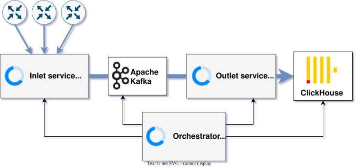

# Troubleshoot Akvorado

> [!WARNING]
> Please read this page carefully before you open an issue or start a discussion.

> [!TIP]
> This guide assumes that you use the *Docker Compose* setup. If you use a different setup, adapt the commands as needed.

As explained in [how Akvorado works](80-design.md), Akvorado has several
components. To troubleshoot an issue, inspect each component.



Your routers send flows to the *inlet*, which sends them to *Kafka*. The
*outlet* takes flows from Kafka, decodes and processes them, and then sends them to
*ClickHouse*. The *orchestrator* configures *Kafka* and *ClickHouse* and
provides the configuration for the *inlet* and *outlet*. The *console* (not shown
here) queries *ClickHouse* to display flows to users.

## Basic checks

First, check that you have enough space. This is a common cause of failure:

```console
$ docker system df
TYPE            TOTAL     ACTIVE    SIZE      RECLAIMABLE
Images          7         7         1.819GB   7.834MB (0%)
Containers      15        15        2.752GB   0B (0%)
Local Volumes   16        9         69.24GB   8.594GB (12%)
Build Cache     4         0         5.291MB   5.291MB
```

You can recover space with `docker system prune` or get more details with
`docker system df -v`. See the documentation about
[operations](13-operating.md#clickhouse) on how to check space usage for
ClickHouse.

> [!CAUTION]
> Do **not** use `docker system prune -a` unless you are sure that all your
> containers are up and running. It is important to understand that this command
> removes anything that is not currently used.

Check that all components are running and healthy:

```console
$ docker compose ps --format "table {{.Service}}\t{{.Status}}"
SERVICE                    STATUS
akvorado-console           Up 27 minutes (healthy)
akvorado-inlet             Up 27 minutes (healthy)
akvorado-orchestrator      Up 27 minutes (healthy)
akvorado-outlet            Up 27 minutes (healthy)
clickhouse                 Up 28 minutes (healthy)
geoip                      Up 28 minutes (healthy)
kafka                      Up 28 minutes (healthy)
kafka-ui                   Up 28 minutes
redis                      Up 28 minutes (healthy)
traefik                    Up 28 minutes
```

Make sure that all components are present. If a component is missing, restarting,
unhealthy, or not working correctly, check its logs:

```console
$ docker compose logs akvorado-inlet
```

When the orchestrator refuses to start, the configuration file is the first
suspect. This command parses it, prints the result with the default values, and
stops:

```console
$ docker compose run --rm --no-deps akvorado-orchestrator orchestrator --check --dump /etc/akvorado/akvorado.yaml
```

The *inlet*, *outlet*, *orchestrator*, and *console* expose metrics. Get them with this command:

```console
$ curl -s http://127.0.0.1:8080/api/v0/inlet/metrics
​# HELP akvorado_cmd_info Akvorado build information
​# TYPE akvorado_cmd_info gauge
akvorado_cmd_info{compiler="go1.24.4",version="v1.11.5-134-gaf3869cd701c"} 1
[...]
```

> [!CAUTION]
> Run the `curl` commands on the same host that runs Akvorado, and change
> `inlet` to the name of the component that you are interested in. Port 8080
> exposes the metrics and the configuration without authentication, so it is
> only published on the loopback interface. Only port 8081, the console, is
> reachable from outside.

To see only error metrics, filter them:

```console
$ curl -s http://127.0.0.1:8080/api/v0/inlet/metrics | grep 'akvorado_.*_error'
```

> [!TIP]
> To see what these metrics look like on a working system, replace
> `http://127.0.0.1:8080` with `https://demo.akvorado.net`. Only the `metrics`
> endpoints are public there. The other ones, like `/api/v0/outlet/flows`, stay
> on the private port and answer 404.

### Inlet service

The inlet service receives NetFlow/IPFIX/sFlow packets and sends them to
Kafka. First, check if you are receiving packets from exporters (your routers):

```console
$ curl -s http://127.0.0.1:8080/api/v0/inlet/metrics | grep 'akvorado_inlet_flow_input_udp_packets'
​# HELP akvorado_inlet_flow_input_udp_packets_total Packets received by the application.
​# TYPE akvorado_inlet_flow_input_udp_packets_total counter
akvorado_inlet_flow_input_udp_packets_total{exporter="241.107.1.12",listener=":2055",worker="2"} 6769
akvorado_inlet_flow_input_udp_packets_total{exporter="241.107.1.13",listener=":2055",worker="1"} 6794
akvorado_inlet_flow_input_udp_packets_total{exporter="241.107.1.14",listener=":2055",worker="2"} 6765
akvorado_inlet_flow_input_udp_packets_total{exporter="241.107.1.15",listener=":2055",worker="0"} 6782
```

If your exporters are not listed, check their configuration. You can also use
`tcpdump` to verify that they are sending packets. Replace the IP with the IP
address of the exporter and the port with the correct port (2055 for NetFlow,
4739 for IPFIX and 6343 for sFlow).

```console
# tcpdump -c3 -pni any host 241.107.1.12 and port 2055
09:11:08.729738 IP 241.107.1.12.44026 > 240.0.2.9.2055: UDP, length 624
09:11:08.729787 IP 241.107.1.12.44026 > 240.0.2.9.2055: UDP, length 1060
09:11:08.729799 IP 241.107.1.12.44026 > 240.0.2.9.2055: UDP, length 1060
3 packets captured
3 packets received by filter
0 packets dropped by kernel
```

If you receive flows but they do not reach Akvorado, check you are running
Docker Engine v23 or more recent:

```console
$ docker version -f '{{ .Server.Version }}'
27.5.1+dfsg4
```

Next, check if flows are sent to Kafka correctly:

```console
$ curl -s http://127.0.0.1:8080/api/v0/inlet/metrics | grep 'akvorado_inlet_kafka_sent_messages'
​# HELP akvorado_inlet_kafka_sent_messages_total Number of messages sent from a given exporter.
​# TYPE akvorado_inlet_kafka_sent_messages_total counter
akvorado_inlet_kafka_sent_messages_total{exporter="241.107.1.12"} 8108
akvorado_inlet_kafka_sent_messages_total{exporter="241.107.1.13"} 8117
akvorado_inlet_kafka_sent_messages_total{exporter="241.107.1.14"} 8090
akvorado_inlet_kafka_sent_messages_total{exporter="241.107.1.15"} 8123
```

If no messages appear here, there may be a problem with Kafka.

### Kafka

The *inlet* sends messages to Kafka, and the *outlet* takes them from
Kafka. The Docker Compose setup comes with [UI for Apache
Kafka](https://github.com/provectus/kafka-ui). You can access it at
`http://127.0.0.1:8080/kafka-ui`.

> [!CAUTION]
> By default, this UI is also served on port 8081, next to the console, and it
> asks for no authentication. It is read-only, but it still shows your topics
> and your brokers to anybody able to reach that port. To keep it on the private
> port, uncomment the block about Kafka-UI in `docker/docker-compose-local.yml`.
> You can then reach it with [SSH port
> forwarding](https://www.digitalocean.com/community/tutorials/ssh-port-forwarding):
> `ssh -L 8080:127.0.0.1:8080 akvorado`. Then, you can use
> `http://127.0.0.1:8080/kafka-ui` directly from your workstation.

Check the various tabs (brokers, topics, and consumers) to make sure that everything is
green. In “brokers”, you should see one broker. In “topics”, you should see
`flows-v5` with an increasing number of messages. This means that the *inlet* is
pushing messages. In “consumers”, you should have `akvorado-outlet`, with at
least one member. The consumer lag should be stable (and low). This is the
number of messages that the *outlet* has not yet processed.

### Outlet

The *outlet* is the most complex component. Check if it works correctly with
this command (it should show one processed flow):

```console
$ curl -s http://127.0.0.1:8080/api/v0/outlet/flows\?limit\=1
{"TimeReceived":1753631373,"SamplingRate":100000,"ExporterAddress":"::ffff:241.107.1.15","InIf":10,"OutIf":21,"SrcVlan":0,"DstVlan":0,"SrcAddr":"::ffff:216.58.206.244","DstAddr":"::ffff:192.0.2.144","NextHop":"","SrcAS":15169,"DstAS":64501,"SrcNetMask":24,"DstNetMask":24,"OtherColumns":null}
```

If you get a flow, you can skip this section. Otherwise, we need to check some
metrics. First, the outlet should receive flows from Kafka:

```console
$ curl -s http://127.0.0.1:8080/api/v0/outlet/metrics | grep 'akvorado_outlet_kafkainput_received_messages'
​# HELP akvorado_outlet_kafkainput_received_messages_total Number of messages received for a given worker.
​# TYPE akvorado_outlet_kafkainput_received_messages_total counter
akvorado_outlet_kafkainput_received_messages_total{worker="0"} 5561
akvorado_outlet_kafkainput_received_messages_total{worker="1"} 5456
akvorado_outlet_kafkainput_received_messages_total{worker="2"} 5583
akvorado_outlet_kafkainput_received_messages_total{worker="3"} 11068
akvorado_outlet_kafkainput_received_messages_total{worker="4"} 11151
akvorado_outlet_kafkainput_received_messages_total{worker="5"} 5588
```

If these numbers are not increasing, there is a problem with receiving from Kafka. If
everything is OK, check if the flow processing pipeline works correctly:

```console
$ curl -s http://127.0.0.1:8080/api/v0/outlet/metrics | grep -P 'akvorado_outlet_core_(received|forwarded)'
​# HELP akvorado_outlet_core_forwarded_flows_total Number of flows forwarded to Kafka.
​# TYPE akvorado_outlet_core_forwarded_flows_total counter
akvorado_outlet_core_forwarded_flows_total{exporter="241.107.1.12"} 182512
akvorado_outlet_core_forwarded_flows_total{exporter="241.107.1.13"} 182366
akvorado_outlet_core_forwarded_flows_total{exporter="241.107.1.14"} 182278
akvorado_outlet_core_forwarded_flows_total{exporter="241.107.1.15"} 182900
​# HELP akvorado_outlet_core_received_flows_total Number of incoming flows.
​# TYPE akvorado_outlet_core_received_flows_total counter
akvorado_outlet_core_received_flows_total{exporter="241.107.1.12"} 182512
akvorado_outlet_core_received_flows_total{exporter="241.107.1.13"} 182366
akvorado_outlet_core_received_flows_total{exporter="241.107.1.14"} 182278
akvorado_outlet_core_received_flows_total{exporter="241.107.1.15"} 182900
​# HELP akvorado_outlet_core_received_raw_flows_total Number of incoming raw flows (proto).
​# TYPE akvorado_outlet_core_received_raw_flows_total counter
akvorado_outlet_core_received_raw_flows_total 45812
```

Notably, `akvorado_outlet_core_received_raw_flows_total` is incremented by one
for each message that is received from Kafka. The message is then decoded, and the flows
are extracted. For each extracted flow,
`akvorado_outlet_core_received_flows_total` is incremented by one. The flows are
then enriched, and before they are sent to ClickHouse,
`akvorado_outlet_core_forwarded_flows_total` is incremented.

If `akvorado_outlet_core_received_raw_flows_total` increases but
`akvorado_outlet_core_received_flows_total` does not, there is an error
**decoding the flows**.

Check this command to find clues:

```console
$ curl -s http://127.0.0.1:8080/api/v0/outlet/metrics | grep 'akvorado_outlet_flow.*errors'
```

If there are no such errors, the exporter may be sending only templates and
options data, but no actual flow records. In this case,
`akvorado_outlet_flow_decoder_flows_total` stays at 0. Check which record types
the outlet receives:

```console
$ curl -s http://127.0.0.1:8080/api/v0/outlet/metrics | grep 'akvorado_outlet_flow_decoder_netflow_records'
​# HELP akvorado_outlet_flow_decoder_netflow_records_total Number of NetFlow records received.
​# TYPE akvorado_outlet_flow_decoder_netflow_records_total counter
akvorado_outlet_flow_decoder_netflow_records_total{exporter="241.107.1.12",type="OptionsDataFlowSet",version="10"} 168
akvorado_outlet_flow_decoder_netflow_records_total{exporter="241.107.1.12",type="OptionsTemplateFlowSet",version="10"} 195
```

If you only see `OptionsDataFlowSet` and `OptionsTemplateFlowSet` but never
`DataFlowSet` or `TemplateFlowSet`, then the exporter does not export any data
records. Only data records produce flows. This is an exporter-side problem: make
sure the flow monitor is attached to interfaces that carry traffic.

If `akvorado_outlet_core_received_flows_total` increases but
`akvorado_outlet_core_forwarded_flows_total` does not, there is an error
**enriching the flows**. Check with this command:

```console
$ curl -s http://127.0.0.1:8080/api/v0/outlet/metrics | grep 'akvorado_outlet_core.*errors'
```

Here is a list of errors that you may find:

- `metadata missing` means that interface information is missing. The most
  likely cause is that the exporter does not accept SNMP requests or the SNMP
  community is configured incorrectly.
- `sampling rate missing` means that the sampling rate information is not present. This
  is normal when Akvorado starts, but it should not keep increasing. With NetFlow,
  the sampling rate is sent in an options data packet. Make sure that your exporter
  sends them (look for `sampler-table` in the documentation). Alternatively,
  you can configure `outlet`→`core`→`default-sampling-rate` to work around this issue.
- `input and output interfaces missing` means that the flow does not contain input
  and output interface indexes. Fix this on the exporter.

A convenient way to check if the SNMP configuration is correct is to use
`tcpdump`.

```console
# nsenter -t $(pgrep -fo "akvorado outlet") -n tcpdump -c3 -pni eth0 port 161
20:46:44.812243 IP 240.0.2.11.34554 > 240.0.2.13.161: C="private" GetRequest(95) .1.3.6.1.2.1.1.5.0 .1.3.6.1.2.1.2.2.1.2.11 .1.3.6.1.2.1.31.1.1.1.1.11 .1.3.6.1.2.1.31.1.1.1.18.11 .1.3.6.1.2.1.31.1.1.1.15.11
20:46:45.144567 IP 240.0.2.13.161 > 240.0.2.11.34554: C="private" GetResponse(153) .1.3.6.1.2.1.1.5.0="dc3-edge1.example.com" .1.3.6.1.2.1.2.2.1.2.11="Gi0/0/0/11" .1.3.6.1.2.1.31.1.1.1.1.11="Gi0/0/0/11" .1.3.6.1.2.1.31.1.1.1.18.11="Transit: Lumen" .1.3.6.1.2.1.31.1.1.1.15.11=10000
^C
2 packets captured
2 packets received by filter
0 packets dropped by kernel
```

If you do not get an answer, there may be several causes:

- the community is incorrect, and you need to fix it
- the exporter is not configured to answer SNMP requests
- your version of Docker is too old, check you are running Docker Engine v23 or more recent:

```console
$ docker version -f '{{ .Server.Version }}'
27.5.1+dfsg4
```

Finally, check if flows are sent to ClickHouse successfully. Use this command:

```console
$ curl -s http://127.0.0.1:8080/api/v0/outlet/metrics | grep -P 'akvorado_outlet_clickhouse_(errors|flow)'
# HELP akvorado_outlet_clickhouse_errors_total Errors while inserting into ClickHouse
# TYPE akvorado_outlet_clickhouse_errors_total counter
akvorado_outlet_clickhouse_errors_total{error="send"} 7
​# HELP akvorado_outlet_clickhouse_flow_per_batch Number of flow per batch sent to ClickHouse
​# TYPE akvorado_outlet_clickhouse_flow_per_batch summary
akvorado_outlet_clickhouse_flow_per_batch{quantile="0.5"} 250
akvorado_outlet_clickhouse_flow_per_batch{quantile="0.9"} 480
akvorado_outlet_clickhouse_flow_per_batch{quantile="0.99"} 950
akvorado_outlet_clickhouse_flow_per_batch_sum 45892
akvorado_outlet_clickhouse_flow_per_batch_count 163
```

If the errors are not increasing and `flow_per_batch_sum` is increasing,
everything is working correctly.

### ClickHouse

The last component to check is ClickHouse. Connect to it with this command:

```console
$ docker compose exec clickhouse clickhouse-client
```

First, check if all the tables are present:

```console
$ SHOW TABLES
    ┌─name────────────────────────────────────────────┐
 1. │ asns                                            │
 2. │ exporters                                       │
 3. │ exporters_consumer                              │
 4. │ flows                                           │
 5. │ flows_1h0m0s                                    │
 6. │ flows_1h0m0s_consumer                           │
 7. │ flows_1m0s                                      │
 8. │ flows_1m0s_consumer                             │
 9. │ flows_5m0s                                      │
10. │ flows_5m0s_consumer                             │
11. │ flows_I6D3KDQCRUBCNCGF4BSOWTRMVIv5_raw          │
12. │ flows_I6D3KDQCRUBCNCGF4BSOWTRMVIv5_raw_consumer │
13. │ icmp                                            │
14. │ networks                                        │
15. │ protocols                                       │
16. │ tcp                                             │
17. │ udp                                             │
    └─────────────────────────────────────────────────┘
```

Check if the various dictionaries are populated:

```console
$ SELECT name, element_count FROM system.dictionaries
   ┌─name──────┬─element_count─┐
1. │ networks  │       5963224 │
2. │ udp       │          5495 │
3. │ icmp      │            58 │
4. │ protocols │           129 │
5. │ asns      │         99598 │
6. │ tcp       │          5883 │
   └───────────┴───────────────┘
```

If you have not used the console yet, some dictionaries may be empty.

To check if ClickHouse is behind, use this SQL query with `clickhouse-client` to
get the lag in seconds:

```sql
SELECT (now()-max(TimeReceived))/60
FROM flows
```

If you still have problems, check the errors that are reported by ClickHouse:

```sql
SELECT last_error_time, last_error_message
FROM system.errors
ORDER BY last_error_time LIMIT 10
FORMAT Vertical
```

### Console

The most common console problems are empty widgets or no flows shown in the
“visualize” tab. Both problems indicate that interface classification is not
working correctly.

Interface classification marks interfaces as either “internal” or “external”. If
you have not configured interface classification, see the [configuration
guide](50-configuration.md#classification). This step is required.

## Next steps

If every component works but the flows arrive late or the counters do not match
the interface counters, the problem is a capacity one. See the [scaling
guide](14-scaling.md).
