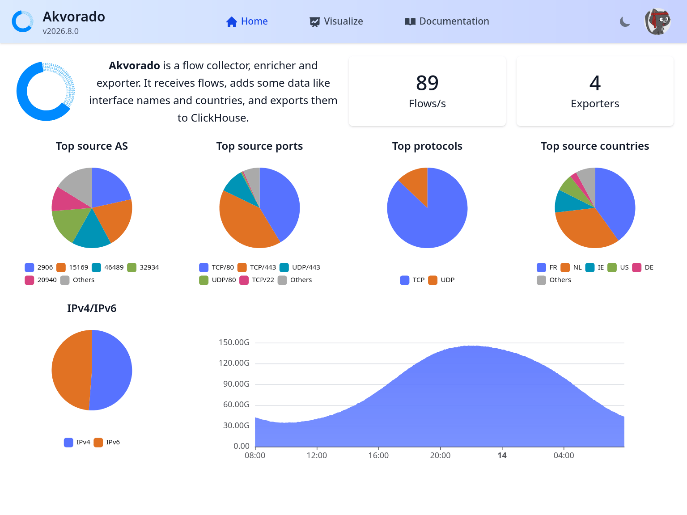
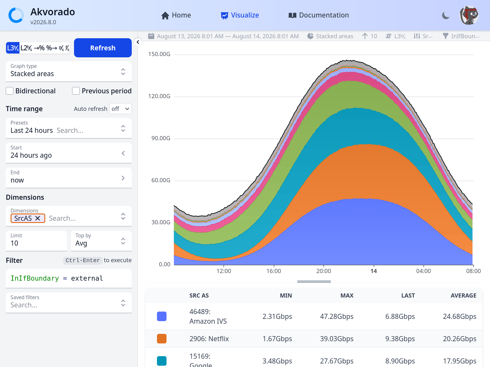
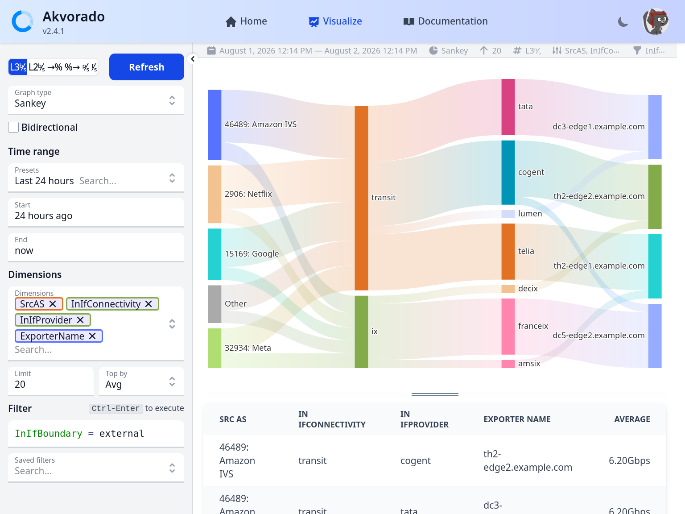

# Web console

The console is the web interface of *Akvorado*. It queries ClickHouse to display
the collected flows. This page describes what each page shows and how to write
filters. If you have never used it, start with the [guided
tour](01-explore.md).

## Home page

The home page contains these statistics:

- number of flows received per second
- number of exporters
- flow distribution by AS, ports, protocols, countries, and IP families
- last flow received

## Visualize page

The most interesting page is the “visualize” tab, which allows you to explore
data with graphs.

The collapsible panel on the left has several options to change the graph's
appearance.

- The unit for the Y-axis: layer-3 bits per second, layer-2 bits per second
  (should match interface counters), packets per second, flows per second, or
  percentage of input or output interface usage. For percentage usage, you
  should group by exporter name and interface name or description for the data
  to be meaningful. Otherwise, you will get an average over the matched
  interfaces. Also, because interface speeds are retrieved infrequently, the
  percentage may be temporarily incorrect when an interface's speed changes.
  Flows per second is the number of flows after sampling. It only makes sense
  for NetFlow and IPFIX (otherwise, it is better to use packets per second).
  Flows per second is also highly dependent of the selected timeframe: zooming
  out changes the displayed values.

- Five graph types are available: “stacked”, “lines”, “grid”, and “heatmap” to
  display time series, and “sankey” to show flow distributions between various
  dimensions.

- For “stacked”, “lines”, and “grid” graphs, the *bidirectional* option adds
  flows in the opposite direction to the graph. They are displayed as negative
  values on the graph. For “sankey” graphs, the *bidirectional* option splits
  the diagram into two side-by-side parts: the left side shows the forward
  direction, the right side shows the reverse direction.

- For “stacked” graphs, the *previous period* option adds a line for
  the traffic levels from the previous period. Depending on
  the current period, the previous period can be the previous hour,
  day, week, month, or year.

- You can set the time range from a list of presets or by using
  natural language. [SugarJS](https://sugarjs.com/dates/#/Parsing) is used for
  parsing and provides examples of what is possible. Alternatively, you can
  look at the presets. You can also enter dates in ISO format, for example:
  `2022-05-22 12:33`. The arrows on the right of the *start* and *end* fields
  move the whole time range one period backward or forward.

- The *auto refresh* selector runs the query again at a regular interval, from
  every 5 seconds to every 5 minutes. It is only available when the end of the
  range is `now`.

- You can select a set of dimensions. For time series, dimensions are
  converted to series. They are stacked with “stacked”, displayed as simple
  lines with “lines”, and displayed in a grid with “grid”. The grid
  representation is useful if you need to compare the volume of each dimension.
  For sankey graphs, dimensions are converted to nodes. In this case, you need
  to select at least two dimensions.

- Akvorado only retrieves a limited number of series. The "limit"
  parameter defines how many. The remaining values are categorized as "Other".

- The `limitType` parameter, used with the `limit` parameter, helps find
  traffic surges in 2 modes:
  - `avg`: default mode, the query gets the highest cumulative traffic over the
    selected time.
  - `max`: the query gets the traffic bursts over the selected time.
  - `last`: the query gets the most recent (last) traffic over the selected
    time.

- The filter box contains an SQL-like expression to limit the data that is
  graphed. It has an auto-completion system that you can trigger with
  `Ctrl-Space`. `Ctrl-Enter` executes the request. You can save filters by
  providing a description. A filter can be shared with other users.

Below the graph, a data table displays per-series statistics including minimum,
maximum, last, average, 95th percentile, and total values. For rate-based units
(bits per second, packets per second, flows per second), the total column shows
the accumulated value over the selected time range (in bytes for bit-based
units, in packets or flows for the others).

The URL contains the encoded parameters and can be shared with
others. However, the stability of the options is not currently
guaranteed, so a URL may stop working after a few upgrades.

## Filter language

> [!TIP]
> [A blog post](https://vincent.bernat.ch/en/blog/2023-sql-like-language-filter)
> explains how this language and its editor are built.

The filter language is similar to SQL with a few variations. Fields listed as
dimensions can usually be used. The accepted operators are `=`, `!=`, `<`, `<=`,
`>`, `>=`, `IN`, `NOTIN`, `LIKE`, `UNLIKE`, `ILIKE`, `IUNLIKE` when they are
applicable. Here are a few examples:

- `InIfBoundary = external` only selects flows where the incoming
  interface was classified as external. The value should not be
  quoted.
- `InIfConnectivity = "ix"` selects flows where the incoming interface is
  connected to an IX.
- `SrcAS = AS12322`, `SrcAS = 12322`, or `SrcAS IN (12322, 29447)`
  limits the source AS number of the selected flows.
- `SrcAddr = 203.0.113.4` only selects flows with the specified
  address. Note that filtering on IP addresses is usually slower.
- `SrcAddr = 203.0.113.0/24` only selects flows that match the
  specified subnet.
- `ExporterName LIKE th2-%` selects flows from routers
  that start with `th2-`.
- `ASPath = AS1299` selects flows where the AS path contains 1299.
- `SrcPort < DstPort`, `DstAS != SrcAS` and `InIfProvider != OutIfProvider`
  compare two fields instead of comparing a field with a constant. This works
  for integer, AS number and string fields, as long as both fields are of the
  same kind. String fields only accept `=` and `!=`.

Field names are case-insensitive. You can also add comments with `--` for
single-line comments or by enclosing them in `/*` and `*/`. Strings can be
enclosed either with single quotes (`'`) or with double quotes (`"`). You can
use `\'` or `\"` to escape quotes, and `\\` to get a single backslash.

The final SQL query sent to ClickHouse is logged in the console after a
successful request. Note that using the following fields will prevent the use of
aggregated data and will therefore be slower:

- `SrcAddr` and `DstAddr`,
- `SrcPort` and `DstPort`,
- `DstASPath`,
- `SrcCommunities` and `DstCommunities`.

