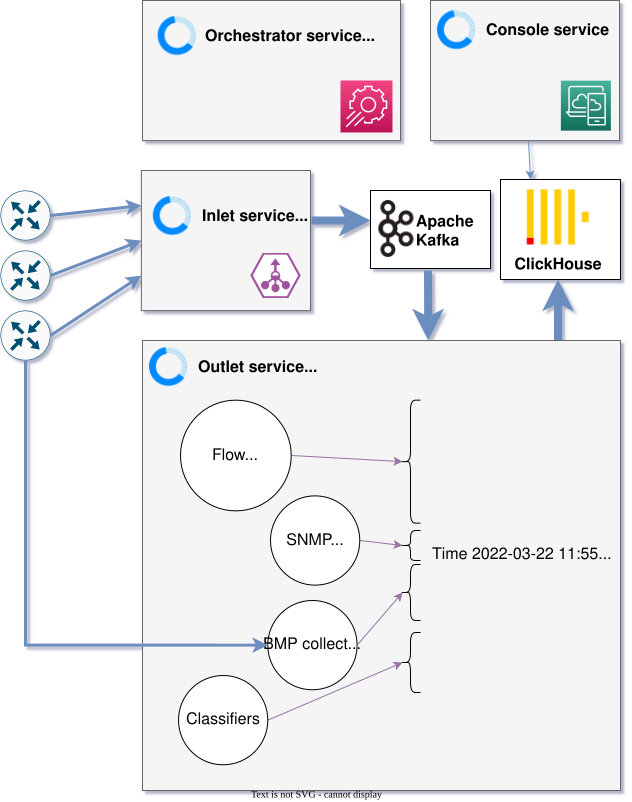

# How Akvorado works

*Akvorado* receives network flows, adds the information the flows do not carry,
and stores the result in a database you can query from a web interface. This
page explains how the pieces fit together. For the code-level view, read the
[internal design](81-internals.md).

## Big picture

*Akvorado* is split into four components:

- The **inlet service** receives flows from exporters and sends them to Kafka
  without parsing them.

- The **outlet service** takes flows from Kafka, parses them, and enriches them
  with metadata. It polls each exporter with SNMP or gNMI to get the *system
  name*, *interface names*, *descriptions* and *speeds*, or reads them from a
  static mapping. It applies rules to add
  attributes to exporters. Interface rules add a *boundary* (external or
  internal), a *network provider* and a *connectivity type* (PNI, IX, transit)
  to each interface. Optionally, it may also receive BGP routes through the BMP
  protocol to get the *AS number*, the *AS path*, and the communities. It also
  looks up *GeoIP* databases and a user-provided list of networks to get the
  *country*, the *city* and per-network attributes. The enriched flows are then
  exported to ClickHouse.

- The **orchestrator service** configures the other components. It creates the
  *Kafka topic* and configures *ClickHouse* to receive the flows from the outlet
  service. It provides configuration settings for the other services.

- The **console service** provides a web interface to view and analyze the flows
  in the ClickHouse database.

## Life of a flow

1. A router samples a packet and sends a NetFlow, IPFIX or sFlow datagram to the
   inlet.

2. The inlet does not look at the content. It puts the datagram into a protobuf
   message and sends it to a Kafka topic.

3. The outlet reads the message, decodes the flows it contains, and completes
   each of them: interface names and speeds from the exporter, AS numbers and AS
   paths from the routing table, country and city from the GeoIP databases, and
   the attributes coming from the classification rules.

4. The outlet writes the result to ClickHouse in batches. It can also send it to
   a second Kafka topic for other consumers.

5. The console builds SQL queries from what the user selects and runs them on
   ClickHouse.

## Why the inlet and the outlet are separate

Receiving UDP packets is urgent work. If the process is busy with something
else, the kernel buffer fills up and the packets are lost for good. Decoding and
enrichment are not urgent: they can wait a few seconds without any consequence.

This is why the inlet only does the first job. Kafka keeps the flows until the
outlet is ready to handle them. When the outlet cannot keep up, the flows are
late but they are not lost: the consumer lag grows, then goes back to normal.
You can also stop the outlet, for example to upgrade it, and it catches up when
it starts again.

The two services also scale in different ways. The inlet is limited by the
kernel and by the number of sockets it listens on. The outlet is limited by the
CPU it needs for decoding and by the speed of ClickHouse, so it adjusts its
number of workers by itself. The [scaling guide](14-scaling.md) covers both.

## Where the data is stored

Flows are stored in a ClickHouse database, in a table named `flows`. The
orchestrator keeps its schema up-to-date. You can check it with `SHOW CREATE
TABLE flows`.

Next to it, *Akvorado* maintains consolidated tables, one per resolution:
`flows_1m0s`, `flows_5m0s` and `flows_1h0m0s`. They hold the same flows
aggregated over a time interval, without the columns that have too many
different values, like IP addresses and ports. Each table has its own retention,
so you can keep one year of hourly data and only two weeks of raw data. When a
query does not need the missing columns, the console reads the smallest table
that can answer it. This is much faster than reading the raw table.

## Schema versions

The name of the Kafka topic ends with a version number, like `flows-v5`. When
the protobuf schema changes in a way that is not backward compatible, this
number changes and the new flows land in a different topic. The matching tables
in ClickHouse are created next to the existing ones instead of replacing them.
During a rolling upgrade, some instances still run the previous version and need
the old tables to keep working. Once every instance runs the new version, the
old tables can be [removed](13-operating.md#old-tables).
